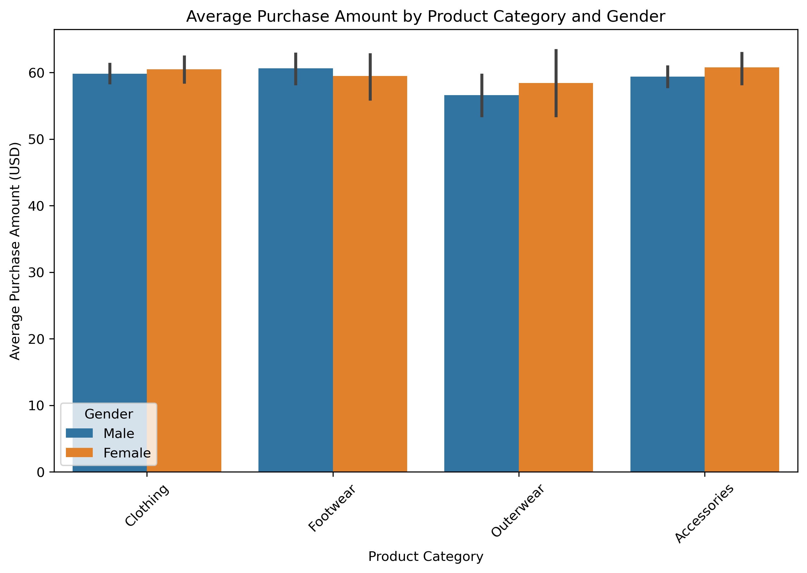
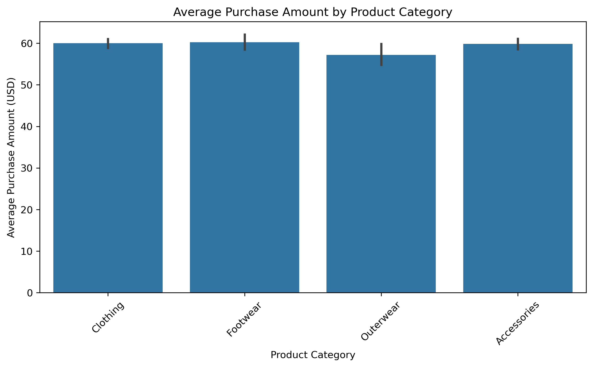
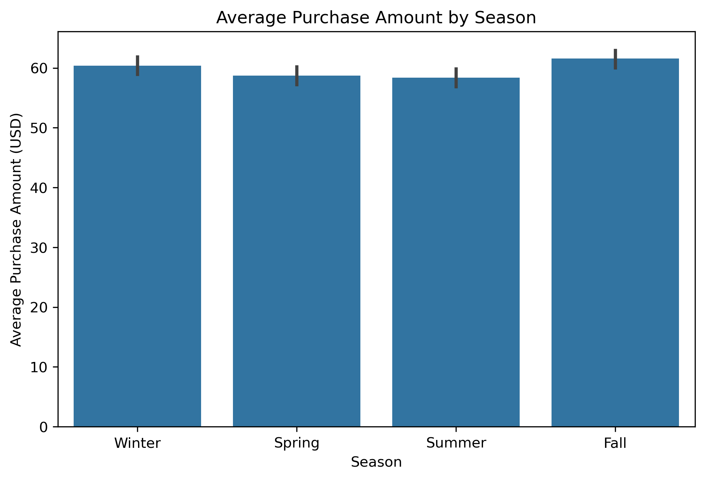
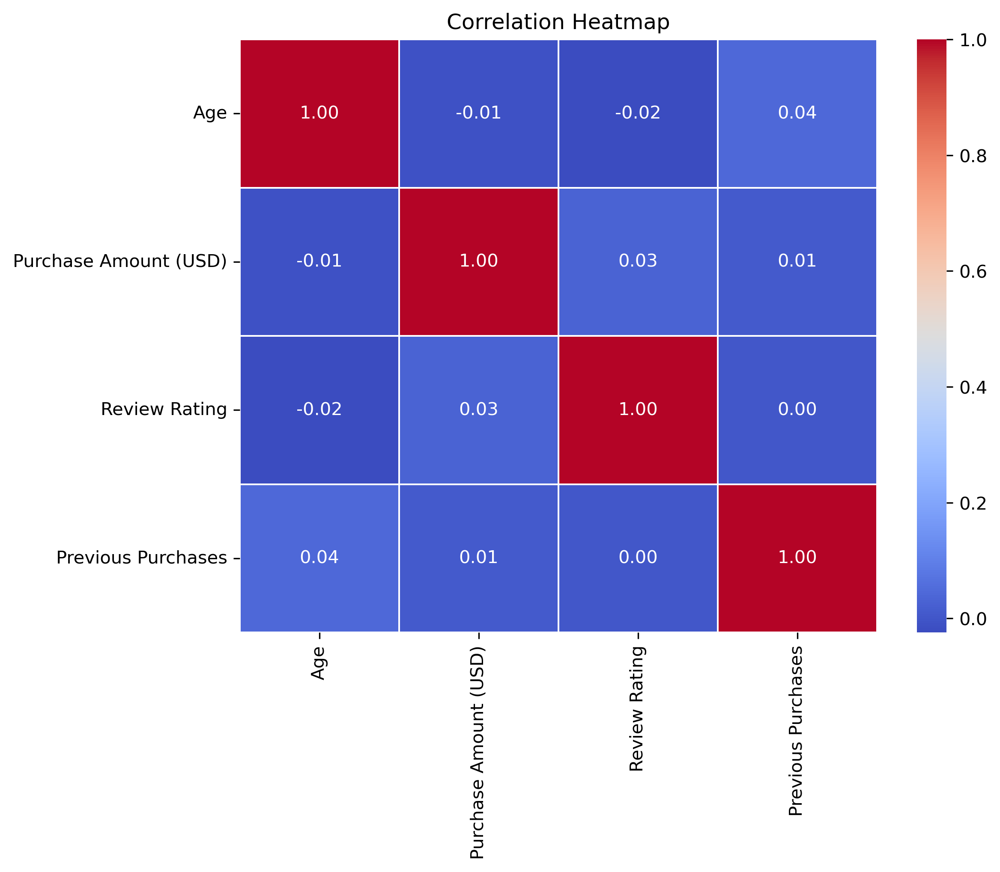
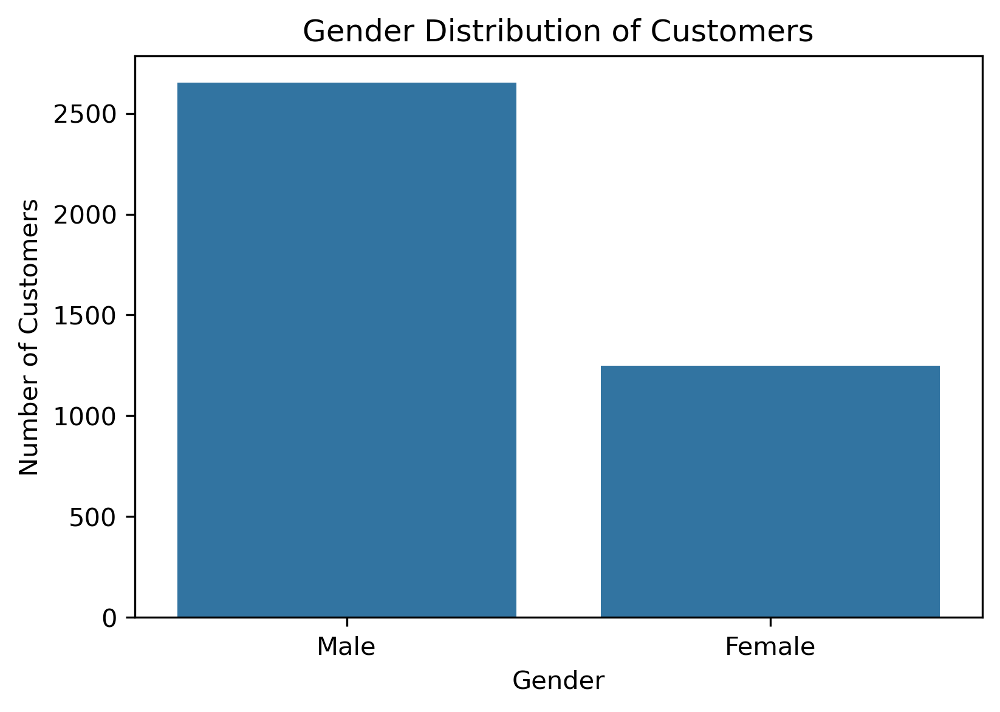
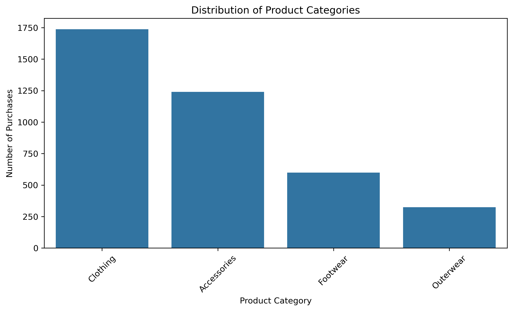
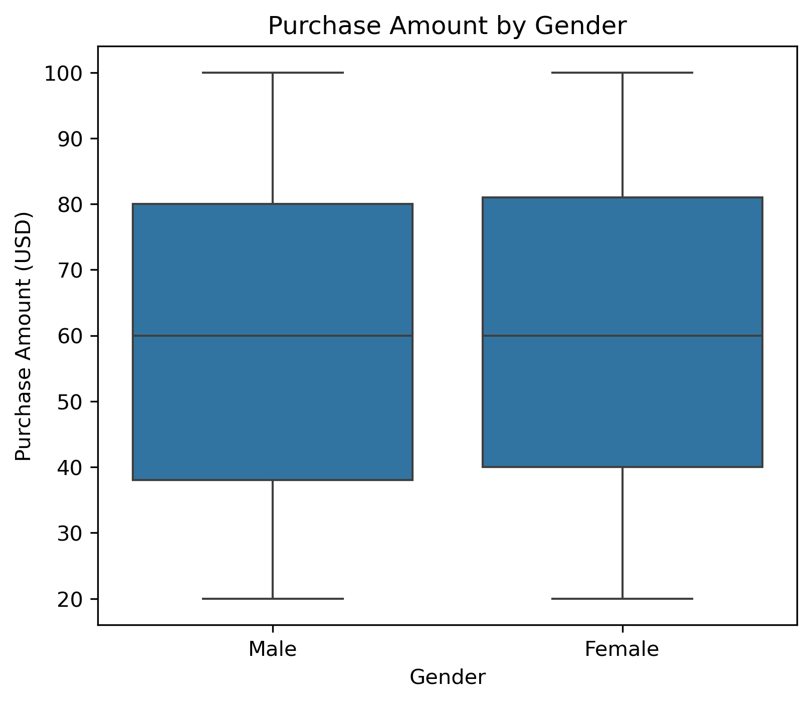

# 🛍️ Customer Shopping Behavior Analysis

## 📌 Project Overview

This project analyzes customer shopping behavior using Python and Exploratory Data Analysis (EDA). The objective is to understand customer purchasing patterns, spending behavior, demographic trends, seasonal preferences, and payment methods to generate meaningful business insights and recommendations.

The project follows a complete data analytics workflow, including data cleaning, feature engineering, descriptive statistics, exploratory data analysis (EDA), pivot table analysis, correlation analysis, data visualization, and business insight generation.

---

## 🎯 Project Objectives

- Analyze customer shopping behavior.
- Identify customer spending patterns.
- Compare purchasing behavior across different customer segments.
- Discover relationships between numerical variables.
- Generate business insights and recommendations using data.

---

## 🛠️ Tools & Technologies

- Python
- Pandas
- NumPy
- Matplotlib
- Seaborn
- Jupyter Notebook

---

## 📂 Dataset

**Dataset Name:** Customer Shopping Behavior Dataset

The dataset contains customer demographic information, purchasing behavior, payment methods, product categories, seasonal purchases, review ratings, and previous purchase history.

---

## 🔄 Project Workflow

1. Data Loading
2. Data Cleaning
3. Feature Engineering (Derived Columns)
4. Descriptive Statistics
5. Exploratory Data Analysis (EDA)
   - Univariate Analysis
   - Bivariate Analysis
   - Multivariate Analysis
6. Pivot Table Analysis
7. Correlation Analysis
8. Data Visualization
9. Business Insights
10. Business Recommendations

---

## 📊 Visualizations

The project includes multiple visualizations to understand customer behavior, including:

- Customer Gender Distribution
- Product Category Distribution
- Purchase Amount Distribution
- Gender vs Purchase Amount
- Product Category vs Purchase Amount
- Season vs Purchase Amount
- Correlation Heatmap
- Product Category and Gender vs Purchase Amount

---

## 📈 Key Business Insights

- Customer spending is relatively consistent across different age groups.
- Product categories show different purchasing patterns.
- Seasonal trends influence customer purchasing behavior.
- Returning customers contribute significantly to total purchases.
- Customers prefer multiple payment methods.
- Customer review ratings are generally positive.
- Numerical variables show weak correlations, indicating purchasing behavior depends on multiple factors.

---

## 💡 Business Recommendations

- Increase promotional campaigns during high-demand seasons.
- Focus marketing on high-performing product categories.
- Strengthen customer loyalty programs.
- Continue offering multiple secure payment methods.
- Use customer segmentation for targeted marketing.
- Monitor customer feedback regularly.
- Apply data-driven decision-making for inventory and sales planning.

---

## 📁 Project Structure

```text
customer-shopping-behavior-analysis/
│
├── Dataset/
│   └── customer_shopping_behavior.csv
│
├── images/
│   ├── 01_gender_distribution.png
│   ├── 02_product_category_distribution.png
│   ├── 03_purchase_amount_distribution.png
│   ├── 04_average_purchase_amount_by_category.png
│   ├── 05_season_vs_purchase_amount.png
│   ├── 06_gender_vs_purchase_amount.png
│   ├── 07_correlation_heatmap.png
│   └── 08_product_category_gender_vs_purchase_amount.png
│
├── customer_shopping_behavior_analysis.ipynb
├── requirements.txt
└── README.md
```

---

## ▶️ How to Run the Project

1. Clone the repository.
2. Install the required libraries.

```bash
pip install -r requirements.txt
```

3. Open the Jupyter Notebook.

```bash
jupyter notebook
```

4. Run all notebook cells.

---

## 📷 Sample Visualizations

### 1. Average Purchase Amount by Category and Gender

Shows the average purchase amount for each product category, separated by customer gender.

<p align="center">
  
</p>
---

### 2. Average Purchase Amount by Product Category

Compares the average purchase amount across different product categories.



---

### 3. Average Purchase Amount by Season

Shows how customer spending changes across different seasons.



---

### 4. Correlation Heatmap

Displays the correlation between Age, Purchase Amount, Review Rating, and Previous Purchases.



---

### 5. Customer Gender Distribution

Shows the distribution of customers by gender.



---

### 6. Product Category Distribution

Shows the number of purchases made in each product category.



---

### 7. Purchase Amount by Gender

Compares the purchase amount distribution between male and female customers.



---

### 8. Purchase Amount Distribution

Shows the overall distribution of customer purchase amounts.
## 👩‍💻 Author

**Harishma G**

- Aspiring Data Analyst
- M.Sc. Mathematics
- Skilled in Python, Pandas, NumPy, Matplotlib, Seaborn, and Exploratory Data Analysis (EDA)
---
